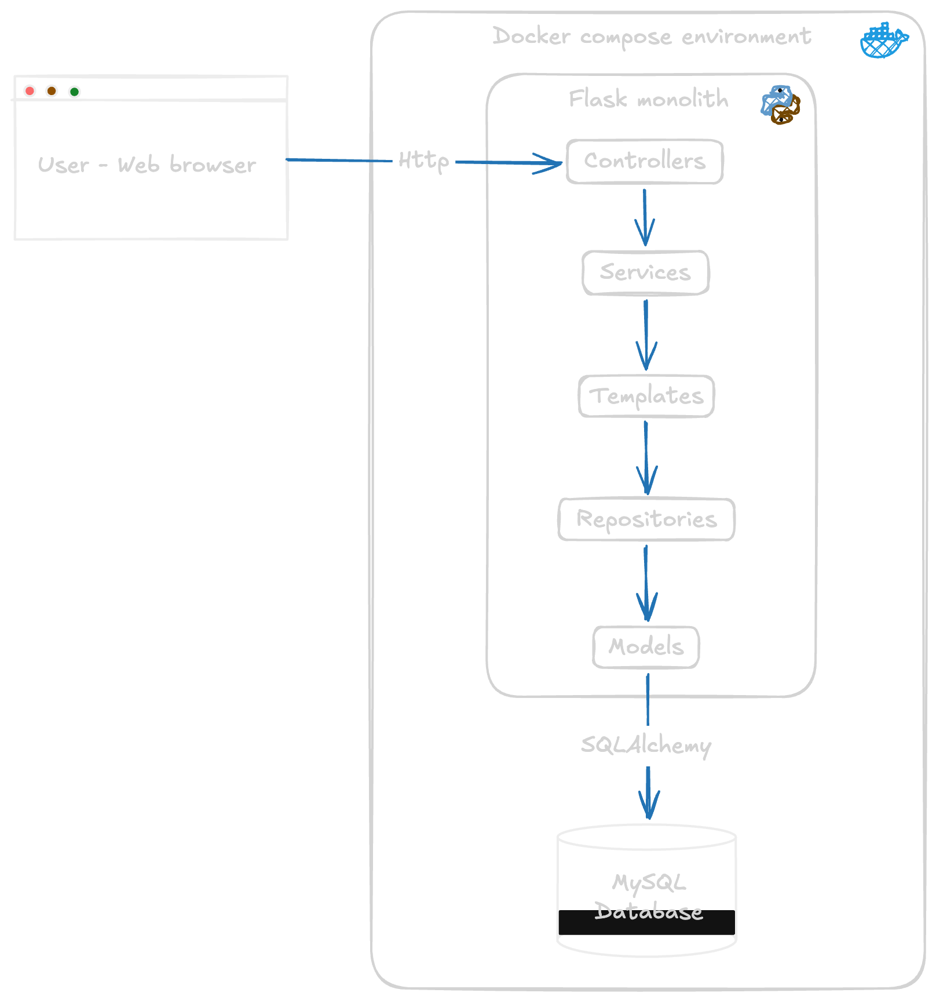

# Lab 1: Architectural design

**Author:** Cristian Steven Motta Ojeda

**Date:** September 15, 2026

A small monolithic web application for managing student grades. It uses Flask for the web application, MySQL for persistence, and Docker Compose for deployment.

## System properties

### 1. Functionality

The system supports a basic grade management workflow: listing, creating, and deleting grades through a web interface.

### 2. Fault tolerance

The system uses one application instance and one database instance, so a failure in either component interrupts the service.

### 3. Maintainability

The system has a layered structure that separates responsibilities:

- Templates handle presentation.
- Controllers handle HTTP requests.
- Services contain application operations.
- Repositories handle data access.
- Models define the database structure.

This makes changes easier. For example changing database access in the repository without directly modifying the templates.

### 4. Performance

Flask handles requests synchronously and retrieves data from MySQL. This is fine for a small application, although performance may decrease with many simultaneous users.

### 5. Portability

The application uses Docker to define its runtime environment and Docker Compose to run both the Flask application and MySQL database consistently across Unix-based environments.

## Graphical representation

