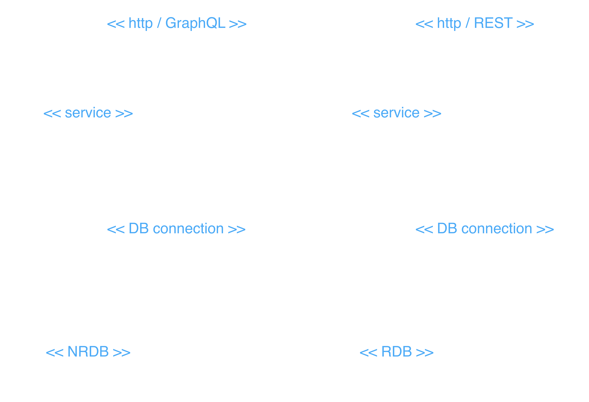

# Lab 2: Components and Connectors

**Author:** Cristian Steven Motta Ojeda

**Date:** September 23, 2026

A simple distributed system with multiple components that communicate using different connectors. The architecture includes a MongoDB database, a GraphQL service, a MySQL database, and a REST API.

## View

## Description

### Components

| Name | Description |
|------|-------------|
| Component 1 | MongoDB database used by the GraphQL service. |
| Component 2 | FastAPI + Strawberry service that exposes GraphQL and stores data in MongoDB. |
| Component 3 | MySQL database used by the REST service. |
| Component 4 | Flask service that exposes HTTP endpoints and stores data in MySQL. |

### Connectors

| Name | Description |
|------|-------------|
| HTTP - REST connector | Used to communicate with the REST API. |
| HTTP - GraphQL connector | Used to communicate with the GraphQL service. |
| Database connectors | Connects each service to its database. |